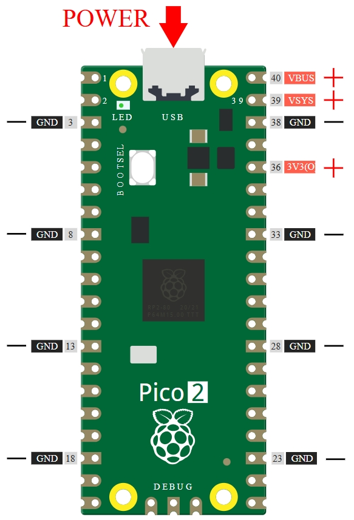
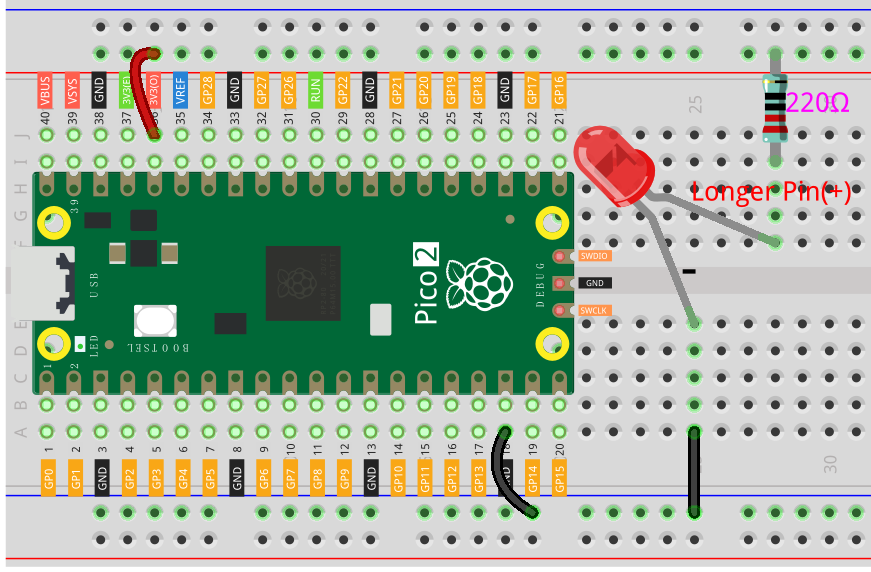
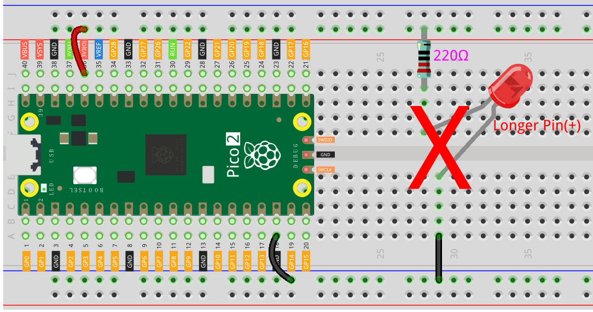

.. note::

    Hello, welcome to the SunFounder Raspberry Pi & Arduino & ESP32 Enthusiasts Community on Facebook! Dive deeper into Raspberry Pi, Arduino, and ESP32 with fellow enthusiasts.

    **Why Join?**

    - **Expert Support**: Solve post-sale issues and technical challenges with help from our community and team.
    - **Learn & Share**: Exchange tips and tutorials to enhance your skills.
    - **Exclusive Previews**: Get early access to new product announcements and sneak peeks.
    - **Special Discounts**: Enjoy exclusive discounts on our newest products.
    - **Festive Promotions and Giveaways**: Take part in giveaways and holiday promotions.

    👉 Ready to explore and create with us? Click [|link_sf_facebook|] and join today!

.. _bc_bb:

Electronic Circuits
======================

Many everyday devices are powered by electricity, such as the lights in your home and the computer you're using right now.

To use electricity, you need to create an electrical circuit, which consists of metal wires and electrical or electronic components.

Circuits require a power source. In your home, most appliances (e.g., TVs, lights) are powered by wall outlets. Smaller, portable circuits (e.g., electronic toys, cell phones) are powered by batteries. A battery has two terminals: the positive terminal, marked with a plus sign (+), and the negative terminal, sometimes marked with a minus sign (-).

For current to flow, a conductive path must connect the positive terminal of the battery to the negative terminal, forming a closed circuit. (If disconnected, it's called an open circuit.) Electric current flows through devices like lamps, making them work (e.g., light up).

.. image:: img/bc1.png

A Pico has several power output pins (positive) and ground pins (negative). By plugging the Pico into a power source, you can use these pins as the positive and negative sides of the power supply.

With electricity, you can create projects involving light, sound, and motion. For example, you can light up an LED by connecting its long pin to the positive terminal and its short pin to the negative terminal. However, doing this directly may damage the LED, so you need to add a 220Ω resistor in the circuit to protect it.

The resulting circuit is shown below:

.. image:: img/bc2.5.png

You might wonder how to build this circuit. Should you hold the wires by hand or tape the pins and wires together?

This is where solderless breadboards become invaluable.

Hello, Breadboard!
---------------------

A breadboard is a rectangular plastic board with many small holes, allowing you to easily insert electronic components and build circuits. Breadboards do not permanently fix components, so you can easily modify or rebuild a circuit if something goes wrong.

.. note::
    You don't need special tools to use breadboards. However, many electronic components are very small, so a pair of tweezers can help you handle them more easily.

There is plenty of information about breadboards available online:

* `How to Use a Breadboard - Science Buddies <https://www.sciencebuddies.org/science-fair-projects/references/how-to-use-a-breadboard#pth-smd>`_
* `What is a Breadboard? - Makezine <https://cdn.makezine.com/uploads/2012/10/breadboardworkshop.pdf>`_

Here are some key points about breadboards:

1. Each half-row group (e.g., columns A-E in row 1 or columns F-J in row 3) is connected internally. So if an electrical signal enters from A1, it can flow out through B1, C1, D1, or E1, but not through F1 or A2.

2. The sides of the breadboard are typically used as power buses. The holes in each column (about 50 holes) are connected together vertically. Usually, the positive power supply is connected near the red line, and the negative power supply is connected near the blue line.

3. In a circuit, current flows from the positive pole to the negative pole after passing through a load. Connecting the positive and negative sides directly can cause a short circuit.

**Let's build the circuit by following the direction of current flow!**

1. In this circuit, we use the 3V3 pin of the Pico board to power the LED. Use a male-to-male (M2M) jumper wire to connect it to the red power bus.
2. To protect the LED, the current must pass through a 220Ω resistor. Connect one end of the resistor (either end) to the red power bus, and the other end to a free row on the breadboard (row 24 in this example).

    .. note::
        The color bands on a 220Ω resistor are red, red, black, black, and brown.

3. The LED has two leads; the longer one is the anode (positive), and the shorter one is the cathode (negative). Connect the longer lead to the same row as the resistor, and the shorter lead to the adjacent row across the middle gap on the breadboard.

    .. note::
        The anode connects to the positive side through a resistor; the cathode connects to the GND pin.

4. Use an M2M jumper wire to connect the LED's short pin to the breadboard's negative power bus.
5. Connect the GND pin of the Pico to the negative power bus using a jumper wire.

Beware of Short Circuits
---------------------------

Short circuits occur when two components that shouldn't be connected are accidentally connected. This kit includes resistors, transistors, capacitors, LEDs, etc., which have long metal pins that can touch each other and cause a short circuit. Some circuits may simply stop functioning properly when a short occurs. Occasionally, a short circuit can permanently damage components, especially if it creates a direct connection between the power supply and ground, causing excessive heat that can melt the breadboard's plastic and damage components.

Always ensure that the pins of all electronic components on the breadboard are not touching each other unintentionally.

Circuit Orientation
-----------------------

Circuits have an orientation, and this is crucial for certain electronic components. Some devices are polarized, meaning they must be connected correctly according to their positive and negative terminals. Circuits built with incorrect orientation will not function properly.

If you reverse the LED in the simple circuit we built earlier, it will no longer work.

In contrast, some components like resistors have no polarity, so reversing them does not affect the circuit's operation.

Most components and modules labeled with "+", "-", "GND", "VCC", or those with pins of different lengths, must be connected to the circuit in a specific way.

Protecting the Circuit
--------------------------

Current is the rate at which electrons flow through a point in a complete electrical circuit. It is measured in amperes (A). Voltage is the driving force behind the flow of current and is measured in volts (V). Resistance (R) opposes the flow of current and is measured in ohms (Ω).

According to Ohm's Law (provided the temperature remains constant), current, voltage, and resistance are related proportionally:

* I = V/R

Where:
    * **I** is the current in amperes (A)
    * **V** is the voltage in volts (V)
    * **R** is the resistance in ohms (Ω)

* `Ohm's Law - Wikipedia <https://en.wikipedia.org/wiki/Ohm%27s_law>`_

Let's conduct a simple experiment to understand Ohm's Law:

By changing the power supply from 3.3V to 5V (i.e., connecting to VBUS, the 40th pin of the Pico), the LED will become brighter. If you replace the 220Ω resistor with a 1kΩ resistor (color bands: brown, black, black, brown, and brown), you'll notice the LED becomes dimmer. The larger the resistance, the dimmer the LED.

.. note::
    For an introduction to resistors and how to calculate resistance values, see :ref:`cpn_res`.

Most pre-packaged modules only require the correct voltage (usually 3.3V or 5V), such as an ultrasonic module.

However, in custom-built circuits, you need to be mindful of the supply voltage and the use of resistors to protect components.

For example, LEDs typically consume about 20mA of current and have a forward voltage drop of about 1.8V. According to Ohm's Law, if we use a 5V power supply, we need to connect a resistor of at least 160Ω \(((5V - 1.8V) / 20mA)\) to prevent damaging the LED.

