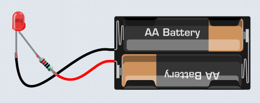
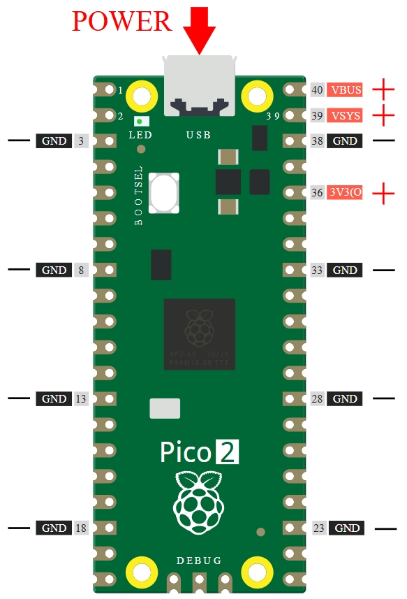
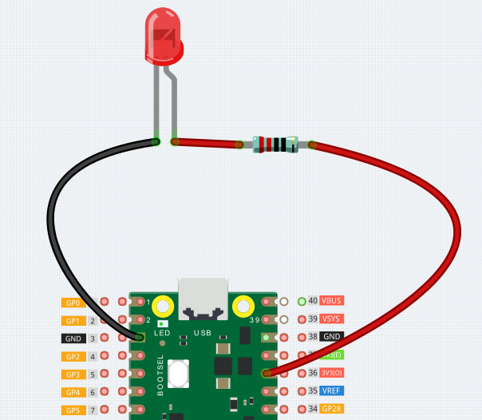
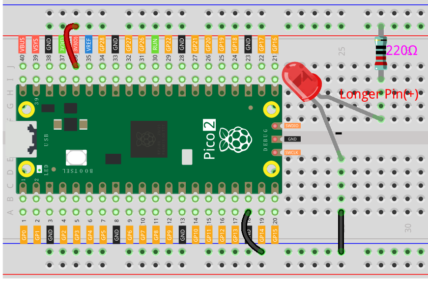
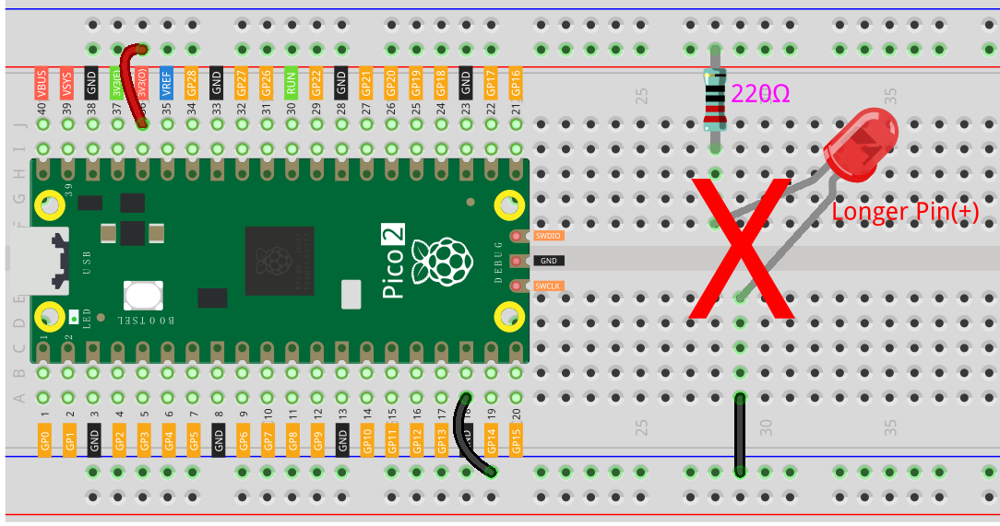

.. note:: 

    Hallo, willkommen in der SunFounder Raspberry Pi & Arduino & ESP32 Enthusiasten-Community auf Facebook! Tauche tiefer in die Welt von Raspberry Pi, Arduino und ESP32 ein – gemeinsam mit Gleichgesinnten.

    **Warum beitreten?**

    - **Expertenunterstützung**: Erhalte Hilfe bei technischen Herausforderungen und nach dem Kauf auftretenden Problemen durch unsere Community und unser Team.
    - **Lernen & Teilen**: Tausche Tipps und Tutorials aus, um deine Fähigkeiten zu verbessern.
    - **Exklusive Vorschauen**: Erhalte frühzeitigen Zugang zu neuen Produktankündigungen und exklusiven Einblicken.
    - **Spezielle Rabatte**: Profitiere von exklusiven Preisnachlässen auf unsere neuesten Produkte.
    - **Feierliche Aktionen und Gewinnspiele**: Nimm an Verlosungen und saisonalen Aktionen teil.

    👉 Bereit, mit uns zu entdecken und zu kreieren? Klicke auf [|link_sf_facebook|] und werde Teil unserer Community!

.. _bc_bb:

Grundlegende Elektronische Schaltungen
=========================================

Viele Alltagsgeräte werden mit Strom betrieben, z. B. die Beleuchtung in deinem Zuhause oder der Computer, den du gerade benutzt.

Um Elektrizität zu nutzen, muss ein elektrischer Stromkreis aufgebaut werden, der aus Metalldrähten und elektrischen oder elektronischen Komponenten besteht.

Ein Stromkreis benötigt eine Energiequelle. In deinem Zuhause werden die meisten Geräte (z. B. Fernseher, Lampen) über Steckdosen mit Strom versorgt. Kleinere, tragbare Schaltungen (z. B. elektronische Spielzeuge, Mobiltelefone) werden durch Batterien betrieben. Eine Batterie hat zwei Anschlüsse: den Pluspol (+) und den Minuspol (-).

Damit Strom fließen kann, muss ein leitender Pfad den Pluspol der Batterie mit dem Minuspol verbinden, wodurch ein geschlossener Stromkreis entsteht. (Wenn die Verbindung unterbrochen ist, spricht man von einem offenen Stromkreis.) Der elektrische Strom fließt durch Verbraucher wie Lampen und lässt sie leuchten.

Ein Pico verfügt über mehrere Stromausgangspins (positiv) und Massepins (negativ). Sobald der Pico an eine Stromquelle angeschlossen ist, können diese Pins als Spannungsversorgung genutzt werden.

Mit Elektrizität lassen sich Projekte mit Licht, Ton und Bewegung realisieren. Beispielsweise kann eine LED leuchten, wenn ihr langer Pin mit dem Pluspol und ihr kurzer Pin mit dem Minuspol verbunden wird. Allerdings kann eine direkte Verbindung die LED beschädigen. Daher muss ein 220Ω-Widerstand in den Stromkreis eingebaut werden, um die LED zu schützen.

Der resultierende Stromkreis sieht wie folgt aus:

Nun stellt sich die Frage, wie dieser Stromkreis aufgebaut wird. Solltest du die Kabel per Hand halten oder sie mit Klebeband fixieren?

Hier kommen lötfreie Steckbretter ins Spiel.

Hallo, Steckbrett!
----------------------

Ein Steckbrett ist eine rechteckige Kunststoffplatte mit vielen kleinen Löchern, die das einfache Einsetzen elektronischer Bauteile und das schnelle Erstellen von Schaltungen ermöglichen. Da Steckbretter die Komponenten nicht dauerhaft fixieren, kannst du Änderungen oder Korrekturen an deiner Schaltung problemlos vornehmen.

.. note::
    Für die Nutzung eines Steckbretts sind keine speziellen Werkzeuge erforderlich. Da jedoch viele elektronische Bauteile sehr klein sind, können Pinzetten hilfreich sein.

Online gibt es zahlreiche Informationen über Steckbretter:

* `How to Use a Breadboard - Science Buddies <https://www.sciencebuddies.org/science-fair-projects/references/how-to-use-a-breadboard#pth-smd>`_
* `What is a Breadboard? - Makezine <https://cdn.makezine.com/uploads/2012/10/breadboardworkshop.pdf>`_

Hier einige wichtige Punkte zum Steckbrett:

1. Jede Halbreihe (z. B. die Spalten A-E in Reihe 1 oder F-J in Reihe 3) ist intern verbunden. Ein Signal, das an A1 anliegt, kann über B1, C1, D1 oder E1 weitergeleitet werden, jedoch nicht über F1 oder A2.

2. Die Seiten des Steckbretts dienen üblicherweise als Stromschienen. Die Löcher einer Spalte (ca. 50 Stück) sind vertikal miteinander verbunden. Normalerweise wird die positive Spannung in der Nähe der roten Linie und die Masse in der Nähe der blauen Linie angeschlossen.

3. Im Stromkreis fließt der Strom vom positiven zum negativen Pol, nachdem er den Verbraucher durchlaufen hat. Eine direkte Verbindung zwischen Plus- und Minuspol kann zu einem Kurzschluss führen.

**Bauen wir den Stromkreis gemäß der Stromflussrichtung auf!**

1. In dieser Schaltung nutzen wir den 3V3-Pin des Pico als Spannungsquelle für die LED. Verwende ein männlich-zu-männlich (M2M) Jumper-Kabel, um ihn mit der roten Stromschiene zu verbinden.
2. Um die LED zu schützen, muss der Strom durch einen 220Ω-Widerstand fließen. Verbinde ein Ende des Widerstands mit der roten Stromschiene und das andere mit einer freien Reihe auf dem Steckbrett (z. B. Reihe 24).

    .. note::
        Die Farbcodierung eines 220Ω-Widerstands ist: Rot, Rot, Schwarz, Schwarz, Braun.

3. Die LED besitzt zwei Anschlüsse: Die längere Anode ist positiv, die kürzere Kathode negativ. Verbinde die Anode mit derselben Reihe wie den Widerstand und die Kathode mit einer angrenzenden Reihe auf der gegenüberliegenden Seite des Steckbretts.

    .. note::
        Die Anode wird über einen Widerstand mit der positiven Seite verbunden, die Kathode mit GND.

4. Nutze ein M2M-Jumper-Kabel, um die kurze LED-Pin mit der negativen Stromschiene des Steckbretts zu verbinden.
5. Verbinde den GND-Pin des Pico über ein weiteres Jumper-Kabel mit der negativen Stromschiene.

Vorsicht vor Kurzschlüssen
-----------------------------

Kurzschlüsse entstehen, wenn zwei Komponenten, die nicht direkt verbunden sein sollten, versehentlich miteinander verbunden werden. Dieses Kit enthält Widerstände, Transistoren, Kondensatoren, LEDs usw., die lange Metallpins haben, die sich berühren und Kurzschlüsse verursachen können. Einige Schaltungen funktionieren bei einem Kurzschluss einfach nicht mehr. In manchen Fällen kann jedoch ein direkter Kontakt zwischen Spannungsversorgung und Masse Bauteile dauerhaft beschädigen, da die entstehende Hitze das Kunststoffgehäuse des Steckbretts schmelzen und Komponenten zerstören kann.

Achte stets darauf, dass sich die Pins aller elektronischen Bauteile auf dem Steckbrett nicht unbeabsichtigt berühren.

Ausrichtung der Schaltung
-----------------------------

Elektronische Schaltungen haben eine bestimmte Ausrichtung, die bei einigen Bauteilen entscheidend ist. Manche Komponenten sind polarisiert und müssen korrekt angeschlossen werden, damit die Schaltung funktioniert.

Wenn du die LED in unserer Schaltung falsch herum einsetzt, wird sie nicht leuchten.

Im Gegensatz dazu haben einige Komponenten, wie Widerstände, keine Polarität. Ihre Ausrichtung hat daher keinen Einfluss auf die Funktion der Schaltung.

Bauteile und Module, die mit „+“, „-“, „GND“ oder „VCC“ gekennzeichnet sind oder unterschiedlich lange Pins haben, müssen in einer bestimmten Richtung angeschlossen werden.

Schutz der Schaltung
------------------------

Elektrischer Strom (I) beschreibt die Flussrate von Elektronen durch einen geschlossenen Stromkreis und wird in Ampere (A) gemessen. Spannung (V) ist die treibende Kraft für den Stromfluss und wird in Volt (V) angegeben. Widerstand (R) hemmt den Stromfluss und wird in Ohm (Ω) gemessen.

Laut Ohmschem Gesetz gilt (bei konstanter Temperatur):

* I = V/R

Dabei gilt:
    * **I** = Stromstärke in Ampere (A)
    * **V** = Spannung in Volt (V)
    * **R** = Widerstand in Ohm (Ω)

* `Ohm'sches Gesetz - Wikipedia <https://de.wikipedia.org/wiki/Ohmsches_Gesetz>`_ 

Lass uns ein einfaches Experiment durchführen, um das Ohm’sche Gesetz besser zu verstehen:

Wenn die Versorgungsspannung von 3,3V auf 5V erhöht wird (z. B. durch Anschluss an VBUS, Pin 40 des Pico), leuchtet die LED heller. Ersetzt du den 220Ω-Widerstand durch einen 1kΩ-Widerstand (Farbcodierung: Braun, Schwarz, Schwarz, Braun, Braun), wird die LED merklich dunkler. Je größer der Widerstand, desto geringer der Stromfluss und umso schwächer das Licht der LED.

.. note::
    Eine Einführung in Widerstände und die Berechnung von Widerstandswerten findest du unter :ref:`cpn_resistor`.

Die meisten vorgefertigten Module benötigen lediglich die richtige Betriebsspannung (meist 3,3V oder 5V), wie beispielsweise ein Ultraschallmodul.

Bei selbstgebauten Schaltungen hingegen musst du besonders auf die Versorgungsspannung achten und Widerstände gezielt einsetzen, um Bauteile zu schützen.

Beispielsweise verbrauchen LEDs typischerweise etwa 20mA Strom und haben eine Durchlassspannung von ca. 1,8V. Gemäß dem Ohm’schen Gesetz muss bei einer 5V-Versorgung ein Widerstand von mindestens 160Ω \(((5V - 1.8V) / 20mA)\) in den Stromkreis eingebaut werden, um Schäden an der LED zu vermeiden.
