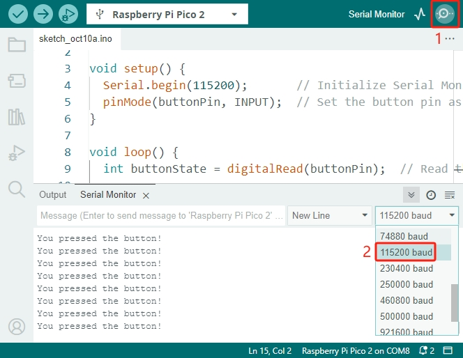

.. note::

    こんにちは！SunFounder Raspberry Pi & Arduino & ESP32 愛好者コミュニティ（Facebook）へようこそ！  
    Raspberry Pi、Arduino、ESP32 の知識を深め、仲間とともにものづくりを楽しみましょう。

    **なぜ参加するのか？**

    - **専門的なサポート**：購入後の問題や技術的な課題を、コミュニティメンバーやチームがサポート。  
    - **学びと共有**：ヒントやチュートリアルを交換し、スキルを向上。  
    - **最新情報の先行公開**：新製品の発表やプレビューをいち早くチェック。  
    - **特別割引**：最新製品を会員限定の特別価格で購入可能。  
    - **イベント & プレゼント企画**：プレゼントキャンペーンや季節ごとのプロモーションに参加可能。  

    👉 一緒にものづくりを楽しみませんか？[|link_sf_facebook|] をクリックして、今すぐ参加！  

.. _ar_button:

2.5 ボタンの入力を読み取る
=============================

このレッスンでは、Raspberry Pi Pico 2 を使用して プッシュボタンの入力を読み取る方法 を学びます。  
これまでのレッスンでは、LED の点灯など GPIO ピンの出力 をメインに扱ってきましたが、  
今回は GPIO ピンを 入力モード にして、ボタンが押されたかどうかを検出します。  
これはインタラクティブなプロジェクトを作成するための基本的なスキルです。

**必要なもの**

このプロジェクトでは、以下のコンポーネントが必要です。

すべて揃ったキットを購入すると便利です。リンクはこちら：

.. list-table::
    :widths: 20 20 20
    :header-rows: 1

    *   - 名称  
        - キットに含まれるアイテム  
        - リンク  
    *   - Newton Lab Kit  
        - 450点以上  
        - |link_newton_lab_kit|  

個別に購入する場合は、以下のリンクからどうぞ。

.. list-table::
    :widths: 5 20 5 20
    :header-rows: 1

    *   - SN  
        - コンポーネント  
        - 数量  
        - リンク  

    *   - 1  
        - :ref:`cpn_pico_2`  
        - 1  
        - |link_pico2_buy|  
    *   - 2  
        - Micro USB ケーブル  
        - 1  
        -  
    *   - 3  
        - :ref:`cpn_breadboard`  
        - 1  
        - |link_breadboard_buy|  
    *   - 4  
        - :ref:`cpn_wire`  
        - 数本  
        - |link_wires_buy|  
    *   - 5  
        - :ref:`cpn_resistor`  
        - 1 (10KΩ)  
        - |link_resistor_buy|  
    *   - 6  
        - :ref:`cpn_button`  
        - 1  
        - |link_button_buy|  

**回路図**

|sch_button|

ボタンの一方の端を 3.3V に接続し、もう一方を GP14 に接続すると、 ボタンが押されたときに GP14 が HIGH（1） になります。しかし、ボタンが押されていないとき、GP14 は不安定な状態 になり、 HIGH か LOW かが保証されません。 そのため、10KΩ のプルダウン抵抗を使って GP14 を GND に接続し、安定した LOW（0）を得られるようにします。

* **ボタンが押されていないとき**：GP14 はプルダウン抵抗を通じて GND に接続され、 **LOW (0)** を読み取る。  
* **ボタンが押されたとき**：GP14 は 3.3V に接続され、 **HIGH (1)** を読み取る。  

**配線図**

四隅にピンを持つプッシュボタンは、"H" の形をしています。  
ボタンの左右の 2 つのピンは内部で接続されており、ボタンを押すと回路がつながります。

|wiring_button|

**コードの記述**

.. note::

   * ``2.5_reading_button_value.ino`` を ``newton-lab-kit/arduino/2.5_reading_button_value`` から開くことができます。  
   * または、このコードを **Arduino IDE** にコピーしてください。  
   * **Raspberry Pi Pico 2** ボードを選択し、適切なポートを設定して「Upload」をクリックしてください。  

.. code-block:: Arduino

   const int buttonPin = 14;  // ボタンに接続する GPIO ピン

   void setup() {
     Serial.begin(115200);       // シリアルモニターを 115200 baud で初期化
     pinMode(buttonPin, INPUT);  // ボタンピンを入力モードに設定
   }

   void loop() {
     int buttonState = digitalRead(buttonPin);  // ボタンの状態を読み取る

     if (buttonState == HIGH) {
       Serial.println("You pressed the button!");
     }
     delay(100);  // 過剰な読み取りを防ぐための短いディレイ
   }

コードをアップロード後：

* Arduino IDE の シリアルモニター を開く（右上の虫眼鏡アイコンをクリック）。  
* ボーレートを 115200 に設定（ ``Serial.begin(115200);`` に合わせる）。  
* ボタンを押すたびに "You pressed the button!" とシリアルモニターに表示される。

**コードの解説**

#. シリアル通信の初期化

   シリアルモニターにデータを表示するため、115200 baud で通信を開始。

   .. code-block:: Arduino

        Serial.begin(115200);

#. ボタンピンの設定

   ``buttonPin`` (GP14) を入力モードとして設定。

   .. code-block:: Arduino

        pinMode(buttonPin, INPUT);

#. ボタンの状態を読み取る

   ボタンの現在の状態を読み取ります。ボタンが押されているときは ``HIGH``、押されていないときは ``LOW`` になります。

   .. code-block:: Arduino

        int buttonState = digitalRead(buttonPin);

#. ボタンが押されたときの処理:

   ボタンが押された場合、シリアルモニターにメッセージを出力します。

   .. code-block:: Arduino

        if (buttonState == HIGH) {
          Serial.println("You pressed the button!");
        }

**別の方法: プルアップ抵抗を使用した配線**

プルアップ抵抗を使用してボタンを接続することも可能です。この構成では:

* **ボタンが押されていない場合**: 3.3V に接続されたプルアップ抵抗の影響で、GP14 は HIGH (1) を読み取る。
* **ボタンが押された場合**: ボタンが GND に接続され、GP14 は LOW (0) を読み取る。

* 配線手順:

  * GP14 から 3.3V に 10KΩ 抵抗を接続。
  * ボタンの片方の端子を GP14 に接続。
  * もう片方の端子を GND に接続。

* コードの変更:

  ``if`` 文の条件を変更する:

  .. code-block:: Arduino

        if (buttonState == LOW) {
          Serial.println("You pressed the button!");
        }

**内部プルアップ抵抗の使用**

Raspberry Pi Pico 2 では、内部プルアップ抵抗 を有効にすることで、外部抵抗なしでボタンを接続できます。

内部プルアップ抵抗を使用することで、配線を簡素化し、ブレッドボード上のスペースを節約 できます。

* **ボタンが押されていない場合**: GP14 は内部プルアップ抵抗の影響で HIGH (1) になる。
* **ボタンが押された場合**: GP14 は GND に接続され、LOW (0) になる。

* 配線手順:

  * 10KΩ 抵抗を取り外す。

* コードの変更:

  * ボタンピンを 内部プルアップ抵抗付きの入力モード に設定。
  * ``if`` 文の条件を変更。

  .. code-block:: Arduino

     const int buttonPin = 14;  // ボタンに接続する GPIO ピン
  
     void setup() {
       Serial.begin(115200);       // シリアルモニターを 115200 baud で初期化
       pinMode(buttonPin, INPUT_PULLUP);  // 内部プルアップ抵抗を有効化
     }
  
     void loop() {
       int buttonState = digitalRead(buttonPin);  // ボタンの状態を読み取る
  
       if (buttonState == LOW) {
         Serial.println("You pressed the button!");
       }
       delay(100);  // 過剰な読み取りを防ぐための短いディレイ
     }

**まとめ**

このレッスンでは、 Raspberry Pi Pico を使用してプッシュボタンの入力を読み取る方法 を学びました。  
この基本スキルを習得することで、プログラムがユーザーの操作に反応するインタラクティブなプロジェクトを作成できるようになります。

**さらに発展させるには？**

* **LED を制御する**: ボタンを押したときに LED を点灯させるようコードを修正。  
* **チャタリング対策**: ボタンの誤検出を防ぐためにデバウンス処理を追加。  
* **複数のボタンを使用する**: 複数のボタンを接続し、異なる動作を実装してみる。  
