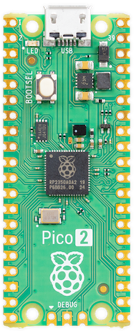

.. note::

    Hello, welcome to the SunFounder Raspberry Pi & Arduino & ESP32 Enthusiasts Community on Facebook! Dive deeper into Raspberry Pi, Arduino, and ESP32 with fellow enthusiasts.

    **Why Join?**

    - **Expert Support**: Solve post-sale issues and technical challenges with help from our community and team.
    - **Learn & Share**: Exchange tips and tutorials to enhance your skills.
    - **Exclusive Previews**: Get early access to new product announcements and sneak peeks.
    - **Special Discounts**: Enjoy exclusive discounts on our newest products.
    - **Festive Promotions and Giveaways**: Take part in giveaways and holiday promotions.

    👉 Ready to explore and create with us? Click [|link_sf_facebook|] and join today!

Introduction to Raspberry Pi Pico 2
==============================================

With a higher core clock speed, double the memory, more powerful Arm cores, optional RISC‑V cores, new security features, and upgraded interfacing capabilities, Raspberry Pi Pico 2 delivers a significant performance boost, while retaining compatibility with earlier members of the Raspberry Pi Pico series.

Programmable in C / C++ and Python, and with detailed documentation, Raspberry Pi Pico 2 is the ideal microcontroller board for enthusiasts and professional developers alike.

Features
--------------

* Raspberry Pi Pico 2 2 is a low-cost, high-performance microcontroller board with flexible digital interfaces. Key features include:
* RP2350 microcontroller chip designed by Raspberry Pi in the United Kingdom
* Dual Cortex-M33 or Hazard3 processors at up to 150MHz
* 520KB of SRAM, and 4MB of on-board flash memory
* USB 1.1 with device and host support
* Low-power sleep and dormant modes
* Drag-and-drop programming using mass storage over USB
* 26x multi-function GPIO pins including 3 that can be used for ADC
* 2x SPI, 2x I2C, 2x UART, 3x 12-bit 500ksps Analogue to Digital Converter (ADC), 24x controllable PWM channels
* 2x Timer with 4 alarms, 1x AON Timer
* Temperature sensor
* 3 x Programmable IO (PIO) blocks, 12 state machines total for custom peripheral support
    * Flexible, user-programmable high-speed IO
    * Can emulate interfaces such as SD Card and VGA

Pico's Pins
------------

.. image:: img/pico-2-r4-pinout.svg
    :width: 800

**Power Pins**

The Pico 2 pinout has been designed to directly bring out as much of the RP2350 GPIO and internal circuitry function as
possible, while also providing a suitable number of ground pins to reduce EMI (Electro Magnetic Interference) and
signal crosstalk. This is important in general but especially for RP2350 which is built on a modern 40nm silicon process
and hence the digital IO edge rates are very fast.

**General purpose I/O**

The Raspberry Pi Pico 2’s GPIO is powered from the on-board 3.3V rail and is therefore fixed at 3.3V.
The Pico 2 exposes 26 of the 30 possible RP2350 GPIO pins by routing them straight out to Pico 2 header pins. GPIO0
to GPIO22 are digital only and GPIO 26-28 are able to be used either as digital GPIO or as ADC inputs (software
selectable).
One thing to note is that the ADC capable GPIO26-29 have an internal reverse diode to the VDDIO (3V3) rail and so the
input voltage must not exceed VDDIO plus about 300mV. Also, if the RP2350 is unpowered, applying a voltage to these
GPIO pins will 'leak' through the diode into the VDDIO rail. Normal digital GPIO pins 0-25 (and also the debug p

Apart from GPIO and ground pins, there are 7 other pins on the main 40-pin interface:

  * **RUN**: The RP2350 enable pin, and has an internal (on-chip) pull-up resistor to 3.3V of about ~50kΩ. To reset RP2350, short this pin low.
  * **ADC_VREF**: The ADC power supply (and reference) voltage, and is generated on Pico 2 by filtering the 3.3V supply. This pin can be used with an external reference if better ADC performance is required.
  * **AGND**: The ground reference for GPIO26-29, there is a separate analog ground plane running under these signals and terminating at this pin. If the ADC is not used or ADC performance is not critical, this pin can be connected to digital ground.
  * **3V3(O)**: The main 3.3V supply to RP2350 and its I/O, generated by the on-board SMPS. This pin can be used to power external circuitry (maximum output current will depend on RP2350 load and VSYS voltage, it is recommended to keep the load on this pin less than 300mA).
  * **3v3(E)**: Connects to the on-board SMPS enable pin, and is pulled high (to VSYS) via a 100kΩ resistor. To disable the 3.3V (which also de-powers the RP2350), short this pin low.
  * **VSYS**: The main system input voltage, which can vary in the allowed range 1.8V to 5.5V, and is used by the on-board SMPS to generate the 3.3V for the RP2350 and its GPIO.
  * **VBUS**: The micro-USB input voltage, connected to micro-USB port pin 1. This is nominally 5V (or 0V if the USB is not connected or not powered).

A few RP2350 GPIO pins are used for internal board functions, these are:

  * **GPIO29** IP Used in ADC mode (ADC3) to measure VSYS/3
  * **GPIO25** OP Connected to user LED
  * **GPIO24** IP VBUS sense - high if VBUS is present, else low
  * **GPIO23** OP Controls the on-board SMPS Power Save pin

The best place to find everything you need to get started with your Raspberry Pi Pico 2 is `here <https://www.raspberrypi.com/documentation/microcontrollers/pico-series.html>`_

Or you can click on the links below: 

* `Raspberry Pi Pico 2 product brief <https://datasheets.raspberrypi.com/pico/pico-2-product-brief.pdf>`_
* `Raspberry Pi Pico 2 Datasheet <https://datasheets.raspberrypi.com/pico/pico-2-datasheet.pdf?_gl=1*898c50*_ga*NTA0MDU1Njg3LjE3MjUzMjY4MDE.*_ga_22FD70LWDS*MTcyNjcxMjQ2MS44LjEuMTcyNjcxMzI1NS4wLjAuMA..>`_
* `Getting started with Raspberry Pi Pico-series Microcontrollers <https://datasheets.raspberrypi.com/pico/getting-started-with-pico.pdf?_gl=1*1naoekg*_ga*NTA0MDU1Njg3LjE3MjUzMjY4MDE.*_ga_22FD70LWDS*MTcyNjcxMjQ2MS44LjEuMTcyNjcxMzI1NS4wLjAuMA..>`_
* `Raspberry Pi Pico 2 C/C++ SDK <https://datasheets.raspberrypi.com/pico/raspberry-pi-pico-c-sdk.pdf>`_
* `Raspberry Pi Pico 2 MicroPython SDK <https://datasheets.raspberrypi.com/pico/raspberry-pi-pico-python-sdk.pdf>`_
* `Raspberry Pi RP2350 datasheet <https://datasheets.raspberrypi.com/rp2350/rp2350-datasheet.pdf>`_
* `Raspberry Pi Pico 2 STEP file <https://datasheets.raspberrypi.com/pico/Pico-2-step-20240708.zip?_gl=1*1ol9494*_ga*NTA0MDU1Njg3LjE3MjUzMjY4MDE.*_ga_22FD70LWDS*MTcyNjcxMjQ2MS44LjEuMTcyNjcxMjYzMC4wLjAuMA..>`_
* `Hardware design with RP2350 <https://datasheets.raspberrypi.com/rp2350/hardware-design-with-rp2350.pdf>`_
