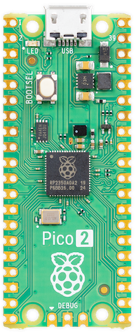

.. note:: 

    Hallo, willkommen in der SunFounder Raspberry Pi & Arduino & ESP32 Enthusiasten-Community auf Facebook! Tauche tiefer in die Welt von Raspberry Pi, Arduino und ESP32 ein – gemeinsam mit Gleichgesinnten.

    **Warum beitreten?**

    - **Expertenunterstützung**: Erhalte Hilfe bei technischen Herausforderungen und nach dem Kauf auftretenden Problemen durch unsere Community und unser Team.
    - **Lernen & Teilen**: Tausche Tipps und Tutorials aus, um deine Fähigkeiten zu verbessern.
    - **Exklusive Vorschauen**: Erhalte frühzeitigen Zugang zu neuen Produktankündigungen und exklusiven Einblicken.
    - **Spezielle Rabatte**: Profitiere von exklusiven Preisnachlässen auf unsere neuesten Produkte.
    - **Feierliche Aktionen und Gewinnspiele**: Nimm an Verlosungen und saisonalen Aktionen teil.

    👉 Bereit, mit uns zu entdecken und zu kreieren? Klicke auf [|link_sf_facebook|] und werde Teil unserer Community!

.. _cpn_pico_2:

Raspberry Pi Pico 2
==============================================

Mit einer höheren Kern-Taktfrequenz, doppeltem Speicher, leistungsstärkeren Arm-Kernen, optionalen RISC‑V-Kernen, neuen Sicherheitsfunktionen und verbesserten Schnittstellen bietet der Raspberry Pi Pico 2 eine deutliche Leistungssteigerung – und bleibt dennoch kompatibel mit den bisherigen Modellen der Raspberry Pi Pico 2-Serie.

Programmierung in C / C++ und Python sowie eine umfassende Dokumentation machen den Raspberry Pi Pico 2 zur idealen Mikrocontroller-Platine für Enthusiasten und professionelle Entwickler gleichermaßen.

Funktionen
--------------

* Der Raspberry Pi Pico 2 ist eine kostengünstige, leistungsstarke Mikrocontroller-Platine mit flexiblen digitalen Schnittstellen. Zu den Hauptmerkmalen gehören:
* RP2350-Mikrocontroller-Chip, entwickelt von Raspberry Pi in Großbritannien
* Dual Cortex-M33 oder Hazard3-Prozessoren mit bis zu 150 MHz
* 520 KB SRAM und 4 MB integrierter Flash-Speicher
* USB 1.1 mit Unterstützung für Gerät- und Host-Modus
* Energiesparende Schlaf- und Ruhemodi
* Drag-and-Drop-Programmierung über Massenspeicher per USB
* 26 multifunktionale GPIO-Pins, darunter 3 für ADC nutzbar
* 2x SPI, 2x I2C, 2x UART, 3x 12-Bit 500ksps Analog-Digital-Wandler (ADC), 24 steuerbare PWM-Kanäle
* 2x Timer mit 4 Alarmausgängen, 1x AON-Timer
* Temperatursensor
* 3 x Programmierbare IO (PIO)-Blöcke mit insgesamt 12 Zustandsmaschinen zur Unterstützung benutzerdefinierter Peripheriegeräte
    * Flexible, vom Benutzer programmierbare Hochgeschwindigkeits-I/O
    * Kann Schnittstellen wie SD-Karte und VGA emulieren

Pico's Pins
------------

.. image:: img/pico-2-r4-pinout.svg
    :width: 800

**Stromversorgungs-Pins**

Das Pinout des Pico 2 wurde so konzipiert, dass möglichst viele GPIO- und interne 
Schaltungsfunktionen des RP2350 direkt zugänglich sind. Gleichzeitig werden ausreichend 
Masse-Pins bereitgestellt, um elektromagnetische Interferenzen (EMI) und Signalübersprechen zu minimieren. 
Dies ist insbesondere wichtig, da der RP2350 auf einem modernen 40-nm-Siliziumprozess basiert und daher sehr 
schnelle digitale I/O-Schaltzeiten aufweist.

**Allzweck-I/O-Pins (GPIO)**

Die GPIOs des Raspberry Pi Pico 2 werden von der integrierten 3,3V-Schiene 
gespeist und arbeiten daher fest mit 3,3V. Der Pico 2 stellt 26 der insgesamt 
30 möglichen RP2350-GPIO-Pins zur Verfügung, die direkt auf die Pico-2-Header 
geleitet werden. GPIO0 bis GPIO22 sind ausschließlich digitale Pins, während 
GPIO26-28 sowohl als digitale GPIOs als auch als ADC-Eingänge genutzt werden 
können (softwarekonfigurierbar).

Ein wichtiger Hinweis: Die ADC-fähigen GPIO26-29 besitzen eine interne Rückwärtsdiode zur VDDIO (3,3V)-Schiene, daher darf die Eingangsspannung VDDIO plus etwa 300mV nicht überschreiten. Zudem kann, wenn der RP2350 nicht mit Strom versorgt wird, eine angelegte Spannung an diesen GPIOs über die Diode in die VDDIO-Schiene „durchsickern“. Normale digitale GPIO-Pins 0-25 (sowie der Debug-Pin) sind davon nicht betroffen.

Zusätzlich zu den GPIO- und Masse-Pins gibt es sieben weitere Pins auf der Haupt-40-Pin-Schnittstelle:

  * **RUN**: Der Enable-Pin des RP2350, intern mit einem Pull-up-Widerstand von etwa 50kΩ auf 3,3V verbunden. Zum Zurücksetzen des RP2350 diesen Pin auf LOW ziehen.
  * **ADC_VREF**: Versorgungsspannung (und Referenz) des ADCs, die auf dem Pico 2 durch Filtern der 3,3V-Versorgung erzeugt wird. Dieser Pin kann für eine externe Referenz verwendet werden, wenn eine höhere ADC-Genauigkeit erforderlich ist.
  * **AGND**: Die Masse-Referenz für GPIO26-29. Eine separate analoge Massefläche unter diesen Signalen terminiert an diesem Pin. Falls der ADC nicht verwendet wird oder dessen Leistung nicht kritisch ist, kann dieser Pin mit der digitalen Masse verbunden werden.
  * **3V3(O)**: Die Haupt-3,3V-Versorgung für den RP2350 und seine I/O, generiert durch den integrierten Schaltregler (SMPS). Dieser Pin kann zur Versorgung externer Schaltungen verwendet werden (maximale Strombelastung abhängig von der RP2350-Last und der VSYS-Spannung, empfohlen sind maximal 300mA).
  * **3V3(E)**: Verbindet sich mit dem Enable-Pin des integrierten SMPS und wird über einen 100kΩ-Widerstand auf VSYS hochgezogen. Um die 3,3V-Versorgung zu deaktivieren (was auch den RP2350 ausschaltet), diesen Pin auf LOW ziehen.
  * **VSYS**: Die Hauptsystem-Eingangsspannung, die im Bereich von 1,8V bis 5,5V variieren kann. Sie wird vom integrierten SMPS genutzt, um die 3,3V für den RP2350 und seine GPIOs zu erzeugen.
  * **VBUS**: Die USB-Mikro-Eingangsspannung, die mit Pin 1 des Mikro-USB-Ports verbunden ist. Normalerweise beträgt diese 5V (oder 0V, falls der USB nicht verbunden oder nicht mit Strom versorgt ist).

Einige RP2350-GPIO-Pins werden für interne Board-Funktionen genutzt:

  * **GPIO29** (IP) Wird im ADC-Modus (ADC3) zur Messung von VSYS/3 verwendet.
  * **GPIO25** (OP) Verbunden mit der Benutzer-LED.
  * **GPIO24** (IP) VBUS-Sensor – HIGH, wenn VBUS anliegt, sonst LOW.
  * **GPIO23** (OP) Steuert den Power-Save-Pin des integrierten SMPS.

Alle relevanten Informationen zum Raspberry Pi Pico 2 findest du `hier <https://www.raspberrypi.com/documentation/microcontrollers/pico-series.html>`_

Oder klicke auf die folgenden Links: 

* `Raspberry Pi Pico 2 Produktübersicht <https://datasheets.raspberrypi.com/pico/pico-2-product-brief.pdf>`_
* `Raspberry Pi Pico 2 Datenblatt <https://datasheets.raspberrypi.com/pico/pico-2-datasheet.pdf>`_
* `Erste Schritte mit Raspberry Pi Pico 2 Mikrocontrollern <https://datasheets.raspberrypi.com/pico/getting-started-with-pico.pdf>`_
* `Raspberry Pi Pico 2 C/C++ SDK <https://datasheets.raspberrypi.com/pico/raspberry-pi-pico-c-sdk.pdf>`_
* `Raspberry Pi Pico 2 MicroPython SDK <https://datasheets.raspberrypi.com/pico/raspberry-pi-pico-python-sdk.pdf>`_
* `Raspberry Pi RP2350 Datenblatt <https://datasheets.raspberrypi.com/rp2350/rp2350-datasheet.pdf>`_
* `Raspberry Pi Pico 2 STEP-Datei <https://datasheets.raspberrypi.com/pico/Pico-2-step-20240708.zip>`_
* `Hardware-Design mit RP2350 <https://datasheets.raspberrypi.com/rp2350/hardware-design-with-rp2350.pdf>`_
